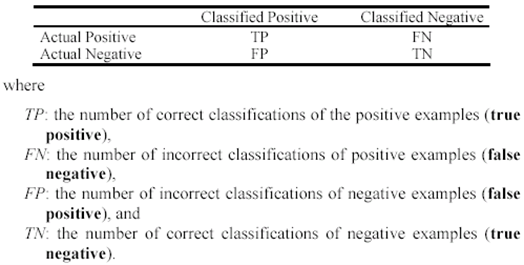

# Lab 5 - Visualization of clustering data

* True Positive Rate (TPR) or Sensitivity 	TPR= TP / (TP + FN)\
  p(model == 1 | actual == 1)
* False Positive Rate	FPR = 1 - (TN / (TN + FP))\
  p(model == 1 | actual == 0)
* Accuracy = (TP + TN) / (TP + TN + FP + FN)\
  p(hit = 1)
* Precision = TP / (TP + FP)
  p(actual == 1| model == 1)

## Python - New things
### ex01
* from pandas import DataFrame == efficient statistic collection
* from sklearn import datasets == set of datasets
* scatter(x, y, s=None, c=None, marker=None, cmap=None, norm=None, vmin=None, vmax=None, alpha=None, linewidths=None, verts=None, edgecolors=None, *, plotnonfinite=False, data=None, **kwargs)[source]\
  plt.scatter(df['x1'], df['x2'], c = res, s=50, alpha = 1) ==  plot y vs x , c seq color (color label), s point radius

### ex02
* import seaborn as sns; sns.set() == theme the plt
* from sklearn.datasets.samples_generator import make_blobs
  X, y_true = make_blobs(n_samples=200, centers=2, == random generated data
* labels = kmeans.fit(X).predict(X) == predict match the test data set 
* centroids = kmeans.cluster_centers_ == cluster center

## Tasks to do:
1.	Open the file EXAM_task1 and read the task solution.
2.	Open the file lab5_ex01.py and read the code. 
3.	Load the data Iris Dataset   # Iris = datasets.load_iris()
Iris dataset consists of 4 measurements on the sepal length, sepal width, petal length, and petal width for 150 iris specimens. There are 50 specimens from each of three species. 
4.	Cluster the Iris Database into 3 clusters using k-means. 
5.	Show the results of clustering on the plot as in the figure below: each cluster sign by different color with selected centroid. 
6.	Compare the clustering results with the true labeling. 

## Individual work:
7.	Select from the Iris Data 100 points from 2 species. Cluster these points into 2 clusters. 
8.	Show the results of the clustering and the silhouette values on plots. Compare the clustering results with the true labeling. (TP, FN, FP and TN). 
9.	Calculate the True Positive rate, False Positive Rate, Accuracy and Precision.
_______________________________________________________________
10.	Open the file lab5_02.py and read the code. Simulate 2 sets of points (in according with different values of cluster_std, random_state). 
11.	Cluster the received datasets into 2 clusters using k-means. Show the clustering results. 
12.	Calculate the True Positive rate, False Positive Rate, Accuracy and Precision.
